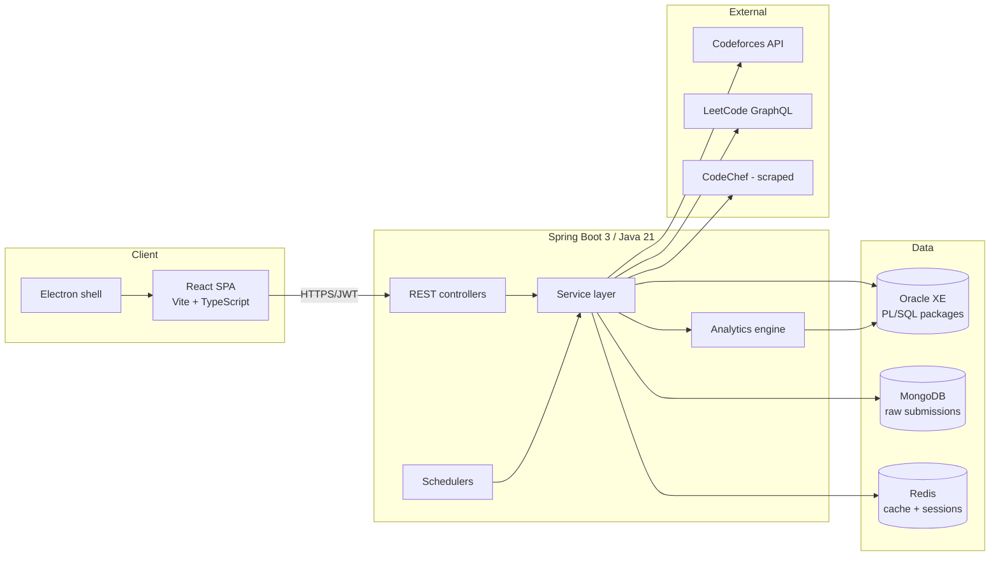
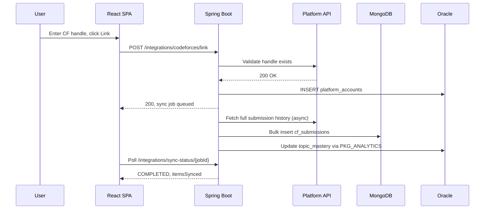
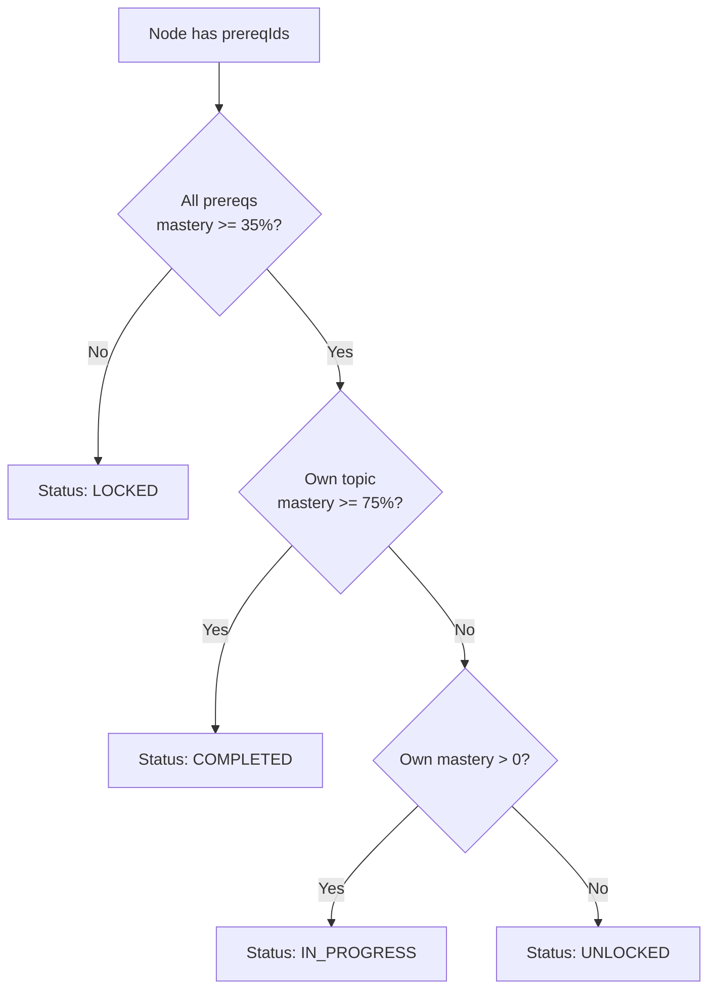
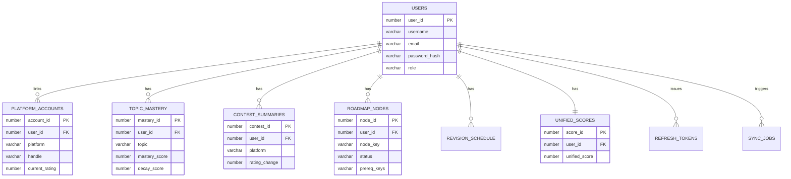

# Architecture

## System overview

## Request flow - linking a platform account

## Roadmap unlock logic

## Entity-relationship diagram

## Why Oracle + PL/SQL for analytics

The mastery, decay, and recommendation logic runs as PL/SQL packages (`PKG_ANALYTICS`, `PKG_RECOMMENDATION`, `PKG_CONTEST`, `PKG_UNIFIED_RATING`) rather than in the Java service layer. This keeps the scoring formulas colocated with the data they read, lets them run inside a single transaction via `SimpleJdbcCall`, and allows Oracle's `DBMS_SCHEDULER` to run nightly recompute jobs independent of application uptime.

## Why MongoDB for submissions

Codeforces, LeetCode, and CodeChef submission payloads have different shapes and change independently of each other. Storing them as loosely-typed documents avoids a brittle shared relational schema, while normalized aggregates (topic mastery, contest summaries) still live in Oracle once computed.
