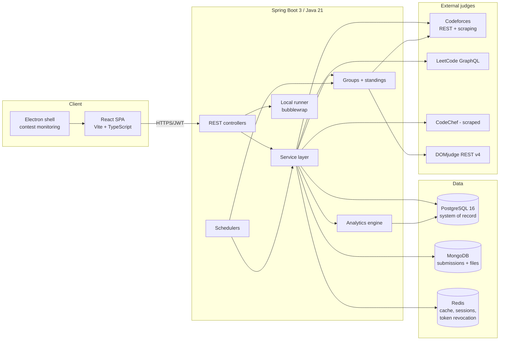
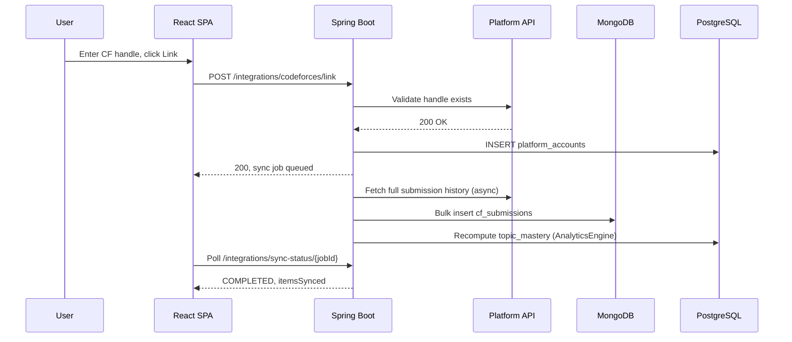
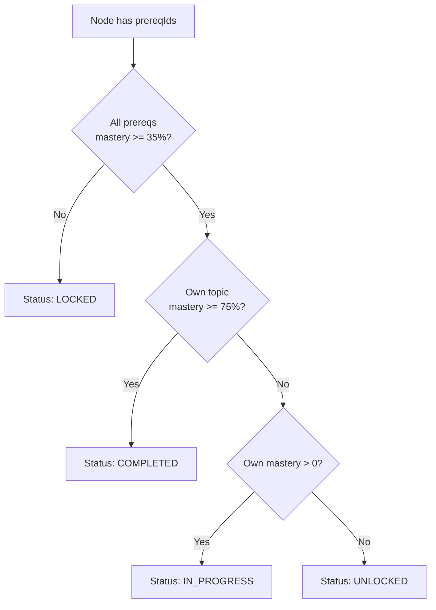
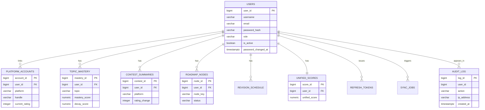
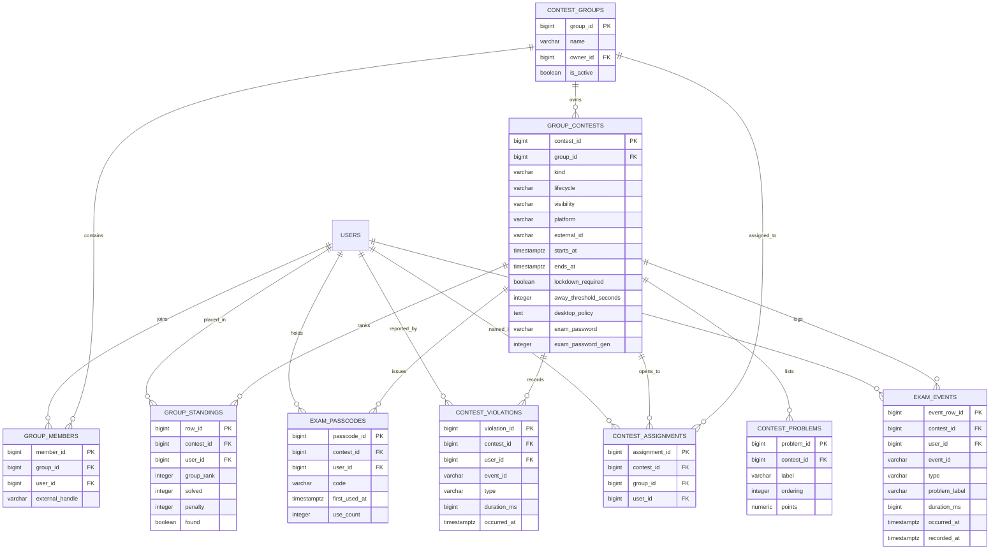

# Architecture

- [System overview](#system-overview)
- [Request flow - linking a platform account](#request-flow---linking-a-platform-account)
- [Roadmap unlock logic](#roadmap-unlock-logic)
- [Entity-relationship diagram](#entity-relationship-diagram)
- [Why the analytics engine lives in Java](#why-the-analytics-engine-lives-in-java)
- [Why MongoDB for submissions](#why-mongodb-for-submissions)
- [The problem-solving workspace](#the-problem-solving-workspace)
- [Personal files, and who decides they are available](#personal-files-and-who-decides-they-are-available)
- [The admin console, and how anyone becomes an admin](#the-admin-console-and-how-anyone-becomes-an-admin)
- [Contest monitoring, and why it stopped trying to lock anything](#contest-monitoring-and-why-it-stopped-trying-to-lock-anything)
- [Group contests: ranking a subset of someone else's scoreboard](#group-contests-ranking-a-subset-of-someone-elses-scoreboard)

## System overview

```mermaid
flowchart LR
    subgraph Client
        FE[React SPA<br/>Vite + TypeScript]
        EL[Electron shell<br/>contest monitoring]
    end

    subgraph Backend [Spring Boot 3 / Java 21]
        API[REST controllers]
        SVC[Service layer]
        ANL[Analytics engine]
        GRP[Groups + standings]
        RUN[Local runner<br/>bubblewrap]
        SCH[Schedulers]
    end

    subgraph Data
        PG[(PostgreSQL 16<br/>system of record)]
        MON[(MongoDB<br/>submissions + files)]
        RED[(Redis<br/>cache, sessions,<br/>token revocation)]
    end

    subgraph Judges [External judges]
        CF[Codeforces<br/>REST + scraping]
        LC[LeetCode GraphQL]
        CC[CodeChef - scraped]
        DJ[DOMjudge REST v4]
    end

    EL --> FE
    FE -- HTTPS/JWT --> API
    API --> SVC
    API --> RUN
    SVC --> ANL
    SVC --> GRP
    SVC --> PG
    SVC --> MON
    SVC --> RED
    ANL --> PG
    SCH --> SVC
    SCH --> GRP
    SVC --> CF
    SVC --> LC
    SVC --> CC
    GRP --> CF
    GRP --> DJ
```

The client is one SPA. The Electron shell loads the same build and adds only what a browser
cannot do — watching the contest window from outside the page.

## Request flow - linking a platform account

```mermaid
sequenceDiagram
    participant U as User
    participant FE as React SPA
    participant API as Spring Boot
    participant EXT as Platform API
    participant MDB as MongoDB
    participant PG as PostgreSQL

    U->>FE: Enter CF handle, click Link
    FE->>API: POST /integrations/codeforces/link
    API->>EXT: Validate handle exists
    EXT-->>API: 200 OK
    API->>PG: INSERT platform_accounts
    API-->>FE: 200, sync job queued
    API->>EXT: Fetch full submission history (async)
    API->>MDB: Bulk insert cf_submissions
    API->>PG: Recompute topic_mastery (AnalyticsEngine)
    FE->>API: Poll /integrations/sync-status/{jobId}
    API-->>FE: COMPLETED, itemsSynced
```

## Roadmap unlock logic

```mermaid
flowchart TD
    A[Node has prereqIds] --> B{All prereqs<br/>mastery >= 35%?}
    B -- No --> L[Status: LOCKED]
    B -- Yes --> C{Own topic<br/>mastery >= 75%?}
    C -- Yes --> D[Status: COMPLETED]
    C -- No --> E{Own mastery > 0?}
    E -- Yes --> F[Status: IN_PROGRESS]
    E -- No --> G[Status: UNLOCKED]
```

## Entity-relationship diagram

The relational half. Split into the three things the schema is actually about: an account and
what is known about it, the record of what people did, and the group-contest machinery laid on
top.

```mermaid
erDiagram
    USERS ||--o{ PLATFORM_ACCOUNTS : links
    USERS ||--o{ TOPIC_MASTERY : has
    USERS ||--o{ CONTEST_SUMMARIES : has
    USERS ||--o{ ROADMAP_NODES : has
    USERS ||--o{ REVISION_SCHEDULE : has
    USERS ||--|| UNIFIED_SCORES : has
    USERS ||--o{ REFRESH_TOKENS : issues
    USERS ||--o{ SYNC_JOBS : triggers
    USERS ||--o{ AUDIT_LOG : appears_in

    USERS {
        bigint user_id PK
        varchar username
        varchar email
        varchar password_hash
        varchar role
        boolean is_active
        timestamptz password_changed_at
    }
    PLATFORM_ACCOUNTS {
        bigint account_id PK
        bigint user_id FK
        varchar platform
        varchar handle
        integer current_rating
    }
    TOPIC_MASTERY {
        bigint mastery_id PK
        bigint user_id FK
        varchar topic
        numeric mastery_score
        numeric decay_score
    }
    CONTEST_SUMMARIES {
        bigint contest_id PK
        bigint user_id FK
        varchar platform
        integer rating_change
    }
    ROADMAP_NODES {
        bigint node_id PK
        bigint user_id FK
        varchar node_key
        varchar status
    }
    UNIFIED_SCORES {
        bigint score_id PK
        bigint user_id FK
        numeric unified_score
    }
    AUDIT_LOG {
        bigint log_id PK
        bigint user_id
        varchar action
        varchar ip_address
        timestamptz created_at
    }
```

`AUDIT_LOG.user_id` is deliberately not a foreign key: the trail records failed sign-ins against
addresses that have no account, and it is meant to outlive the accounts it mentions.

### Teams, contests and examinations

```mermaid
erDiagram
    CONTEST_GROUPS ||--o{ GROUP_MEMBERS : contains
    CONTEST_GROUPS ||--o{ GROUP_CONTESTS : owns
    CONTEST_GROUPS ||--o{ CONTEST_ASSIGNMENTS : assigned_to
    GROUP_CONTESTS ||--o{ CONTEST_ASSIGNMENTS : opens_to
    GROUP_CONTESTS ||--o{ CONTEST_PROBLEMS : lists
    GROUP_CONTESTS ||--o{ GROUP_STANDINGS : ranks
    GROUP_CONTESTS ||--o{ CONTEST_VIOLATIONS : records
    GROUP_CONTESTS ||--o{ EXAM_EVENTS : logs
    GROUP_CONTESTS ||--o{ EXAM_PASSCODES : issues
    USERS ||--o{ EXAM_PASSCODES : holds
    USERS ||--o{ GROUP_MEMBERS : joins
    USERS ||--o{ CONTEST_ASSIGNMENTS : named_in
    USERS ||--o{ GROUP_STANDINGS : placed_in
    USERS ||--o{ CONTEST_VIOLATIONS : reported_by
    USERS ||--o{ EXAM_EVENTS : sat

    CONTEST_GROUPS {
        bigint group_id PK
        varchar name
        bigint owner_id FK
        boolean is_active
    }
    GROUP_MEMBERS {
        bigint member_id PK
        bigint group_id FK
        bigint user_id FK
        varchar external_handle
    }
    GROUP_CONTESTS {
        bigint contest_id PK
        bigint group_id FK
        varchar kind
        varchar lifecycle
        varchar visibility
        varchar platform
        varchar external_id
        timestamptz starts_at
        timestamptz ends_at
        boolean lockdown_required
        integer away_threshold_seconds
        text desktop_policy
        varchar exam_password
        integer exam_password_gen
    }
    EXAM_PASSCODES {
        bigint passcode_id PK
        bigint contest_id FK
        bigint user_id FK
        varchar code
        timestamptz first_used_at
        integer use_count
    }
    CONTEST_ASSIGNMENTS {
        bigint assignment_id PK
        bigint contest_id FK
        bigint group_id FK
        bigint user_id FK
    }
    CONTEST_PROBLEMS {
        bigint problem_id PK
        bigint contest_id FK
        varchar label
        integer ordering
        numeric points
    }
    EXAM_EVENTS {
        bigint event_row_id PK
        bigint contest_id FK
        bigint user_id FK
        varchar event_id
        varchar type
        varchar problem_label
        bigint duration_ms
        timestamptz occurred_at
        timestamptz recorded_at
    }
    GROUP_STANDINGS {
        bigint row_id PK
        bigint contest_id FK
        bigint user_id FK
        integer group_rank
        integer solved
        integer penalty
        boolean found
    }
    CONTEST_VIOLATIONS {
        bigint violation_id PK
        bigint contest_id FK
        bigint user_id FK
        varchar event_id
        varchar type
        bigint duration_ms
        timestamptz occurred_at
    }
```

`GROUP_CONTESTS.external_id` is a string rather than a number because a Codeforces contest id and
a DOMjudge contest id have nothing in common. `GROUP_STANDINGS` is a cached snapshot, not a view:
building it costs one rate-limited API call per member on Codeforces.

One table holds contests and examinations, separated by `kind`. Everything downstream — the
arena, standings, the violation trail — is genuinely the same for both, and a second table
would have meant a second copy of all of it, drifting. What an examination adds is on the row:
its place in a lifecycle, the away threshold it measures against, and the desktop policy it
asks a locked-down client for.

`CONTEST_ASSIGNMENTS` is why `group_id` on a contest is nullable. Who may enter is a union of
three routes — an assigned team, a named individual, or a public contest — and an examination
set for four candidates who missed the first sitting belongs to no team at all. Exactly one of
`group_id` and `user_id` is set per row, enforced by a check constraint, because a row naming
both would have two meanings and no way to say which one an admin removed.

`EXAM_EVENTS` is wider than `CONTEST_VIOLATIONS` on purpose. The violation trail holds what the
monitor observed and is what the standings screen summarises; the event log holds the ordinary
course of a session as well — entered, problem opened, submitted, verdict — so that a candidate's
row afterwards reads as what they did rather than only as what was held against them. Merging
them would bury three focus losses in four hundred problem-opened rows.

### Document collections (MongoDB)

| Collection | Holds | Why it is not relational |
|---|---|---|
| `cf_submissions`, `lc_submissions`, `cc_submissions` | Raw submission history per platform | Three different shapes from three platforms, none of which we control |
| `code_submissions` | Source code sent from the editor | The only copy for contests CPIntel forwards |
| `contest_snapshots` | Scraped contest pages | Whole documents, read as a unit |
| `activity_feed` | Per-user activity entries | Append-only, never joined |
| `personal_files` | Uploaded templates and notes, bytes inline | Small by construction; one round trip beats GridFS |
| `contest_file_rules` | Per-contest exceptions to the file policy | A handful of rows, written by hand |

## Why the analytics engine lives in Java

The mastery, decay, recommendation, and unified-rating logic runs as Spring services
(`AnalyticsEngine`, `RecommendationEngine`, `ContestAnalysisService`, `UnifiedRatingService`)
over the pure functions in `ScoringFormulas`.

This was four PL/SQL packages on Oracle. Colocating the formulas with the data read well on
paper, but in practice every tuning change to a weight or a curve became a Flyway migration
that replaced a whole package body, and there was no way to exercise a formula without a
running database — four of the twenty Oracle migrations existed purely to patch arithmetic.
Moving the maths into pure functions makes it directly unit-testable (`ScoringFormulasTest`)
and turns a scoring change back into an ordinary code change.

Two Oracle facilities had to be replaced rather than ported:

- `DBMS_SCHEDULER` jobs became Spring `@Scheduled` methods on `AnalyticsScheduler`. Postgres
  has no in-database scheduler, so nightly recompute is now tied to application uptime — the
  one capability genuinely lost in the move.
- `DBMS_MVIEW.REFRESH` became `MaterializedViewRefresher`, which issues
  `REFRESH MATERIALIZED VIEW CONCURRENTLY` where possible. Each view carries a unique index
  so concurrent refresh is available; the first refresh after a rebuild has to be
  non-concurrent, because Postgres rejects `CONCURRENTLY` on a view that has never been
  populated.

## Why MongoDB for submissions

Codeforces, LeetCode, and CodeChef submission payloads have different shapes and change independently of each other. Storing them as loosely-typed documents avoids a brittle shared relational schema, while normalized aggregates (topic mastery, contest summaries) still live in PostgreSQL once computed.

## The problem-solving workspace

Practice, Compete and examinations are the same shape, and share their components: a draggable divider with
the statement on one side and, on the other, an editor above a testcase console. It is the
layout every judge converged on, which is the main argument for it — people already know how to
use it.

Three details in `SplitPane` do most of the work, and each exists because the naive version
fails:

- **Pointer capture.** Monaco and the scraped statement HTML both swallow mouse events, so a
  drag that began on the divider would die the moment the cursor crossed into a pane.
- **Panes go inert mid-drag.** Without it, dragging across the editor leaves a trail of selected
  text behind the cursor.
- **Percentages, not pixels.** The split then survives a window resize, a collapsed sidebar and
  the difference between a laptop and an external monitor, none of which a stored pixel width
  survives.

The runner speaks C++ and Python 3, one `LanguageRuntime` each. Python's is the interesting one:
it has a build step although it does not need one. `py_compile` parses the file before anything
runs, so a syntax error is reported once with a line and a caret rather than as the same runtime
error on all twelve of a problem's samples with the real message buried in twelve tracebacks.

`LanguageRuntime.limitAddressSpace` warns that an interpreter may reserve far more virtual
address space than it commits, and that capping it can stop one starting at all. That is true of
a JVM and was measured *not* to be true of CPython here — a trivial program peaks around 20 MB
of address space and starts cleanly under a 256 MB cap — so Python keeps the cap. It is worth
having: without it a one-line Python program quietly takes a gigabyte of the host, and with it
the same program gets a `MemoryError` and is reported as a runtime error on that test. The
measurement is in `PythonRunnerTest` rather than in a comment, so it stays true.

The console seeds its cases from the statement's samples as **editable** rows rather than
showing them read-only, because the first thing anyone does with a failing sample is change one
number in it. Cases added by hand carry no expected output and simply report what the program
printed, which is what a separate "run on custom input" box used to be for.

These two routes are the only ones that opt out of the app's centred column: they manage their
own height and take the full width, because a max width and a page scrollbar fight the split
rather than help it.

## Languages, and the three vocabularies for them

Nobody in this system agrees on what a language is called. Codeforces names *compilers* — "GNU
G++20 13.2 (64 bit, winlibs)", "PyPy 3.10 (7.3.15, 64bit)" — and renames them as it upgrades.
DOMjudge uses short ids that vary per installation: `cpp`, `c`, `py3`, `kt`. The local runner has
its own, because it is driving a toolchain on this machine rather than talking to anyone.

An administrator saying "this paper is C++ and Python only" is not speaking any of those. So
`com.cpintel.common.Languages` holds CPIntel's own names, an examination's allow-list is stored
in them, and every judge's vocabulary is mapped onto them at the edge. That is what lets one
decision hold across two judges and a local compiler without the admin learning three
vocabularies.

The catalogue's ids are deliberately the same strings the runner uses for the languages it can
run — `cpp`, `python3`. One namespace rather than two, so the same set gates the Run button and
the Submit button and they cannot drift. `LanguagesTest` asserts that every entry in the
catalogue is reachable by classification, because an entry an admin could tick that nothing ever
classifies to would be a rule that silently banned everything.

### Where it is enforced, and why there

`LanguagePolicy` sits in the service layer beside `ProctoringGate`, for the reason that one
does: the restriction is a property of the **event**, not of the judge it runs on. Inside a
provider it would have to be written twice, and the copy in the Codeforces provider would drift
from the DOMjudge one until a paper was restricted on one judge and open on the other.

Three surfaces, one rule:

- `CompeteService.languages()` narrows the judge's list for the editor's picker.
- `CompeteService.submit()` refuses anything not on that same narrowed list. Reading the
  *filtered* list rather than re-deriving the rule is what makes "you were offered it" and "you
  may send it" one statement instead of two that can disagree.
- `RunController` narrows the local runner's list and refuses a run. That third one matters more
  than it looks: a rule holding only at Submit holds in the place a candidate touches once and
  not in the place they touch every two minutes.

The gate costs a call to the judge's language catalogue, which on Codeforces means scraping a
page — so it runs **only when an admin actually restricted something**. Practice, every contest
and most examinations never pay for it.

### Two directions of failure, chosen deliberately

An unrecognised judge language is **not allowed** while a restriction is on. An admin who named
three languages meant three; admitting a fourth because a judge calls it something unfamiliar
overrules them silently. It fails closed, visibly, and clearing the restriction is the way back.

A stored list that recognises **nothing** is treated as no restriction at all. The other reading
— "nothing is allowed" — locks a whole room out of a paper over a stored value none of them can
see or fix. The two look contradictory and are not: the first is about one language among
several that work, the second is about a rule that has become unusable as a whole.

Names are validated when the examination is saved, so the usual way of reaching the second case
— a typo — is refused at the point somebody can still fix it.

## Personal files, and who decides they are available

A contestant's own reference material - a template, a snippets header, a scanned team notebook - is stored per user in Mongo (`personal_files`) and served back only to the person who uploaded it. There is no sharing model and no admin read path.

Two questions are kept apart deliberately, because every real request for this feature mixes them up:

- **Does the deployment have the feature?** Configuration: `cpintel.files.contest-access.enabled-by-default`, which ships `true`.
- **Does *this contest* offer it?** An admin's rule, held in `contest_file_rules` and resolved by `ContestFilePolicy` - contest rule first, then a deployment-wide rule, then the configured default.

Rules are stored as exceptions rather than a row per contest, so the admin listing is short enough to audit before a round and the normal case costs nothing. Today no rules exist anywhere, so every contest allows personal files.

The split is what lets the default stay on while one proctored round is off. It is also why the contest page reads files through `/api/compete/{id}/files` rather than `/api/files`: the rule is enforced on every request, not checked once at page load and then trusted. Closing a contest stops that contest serving files; it never takes away someone's own storage, which stays reachable through the library routes.

A rule lookup that fails falls back to the configured default rather than failing the contest page - during a live round, a panel that should have been hidden beats a page that will not load.

## Passwords, and who knows them

An account is created by an administrator, and its first password is handed over with the
username — on a deployment sheet, in a room, however that arrangement works. Nothing is mailed
to bootstrap an account. Two reasons, and the second is the one that decides it: a mailed first
password is a live credential sitting in a mailbox, and the networks this runs on cannot always
reach a mail server at the moment the accounts are being made.

The consequence is worth naming rather than glossing: **until the owner changes it, somebody
else knows their password.** So `users.password_changed_at` records when they last set one
themselves, and null is a fact rather than a missing value. The owner's own profile says it
("you are still using the password you were given"), and the admin user list has a column for
it — a roster of "as issued" is a room that has not been asked to change theirs.

Changing it is `PasswordService`, by either of two routes. Signed in, from `/profile`, which
asks for the current password — a valid session can be an unlocked laptop, and that field is
what makes the person at the keyboard the owner rather than whoever sat down after them. Or
unable to sign in at all, through a link emailed to the address on the account.

Three things make that link safe enough to email. **Only its digest is stored**, so a dump of
`verification_tokens` contains nothing redeemable — the raw token exists in the email and
nowhere else. **It is single use and short lived**, and issuing a new one retires the last, so
a mailbox holding four reset mails holds one working link. And **redeeming it ends every
session**, because somebody resetting a password they believe is known to somebody else has not
finished until the other party is signed out, and making them find a "sign out everywhere"
button afterwards means most people never will.

`/auth/forgot-password` answers identically whether or not the address belongs to an account —
link sent, address unknown, account deactivated, all the same response. It is reachable without
authentication, and an answer that distinguished them would be a way to test a list of
addresses against the roster of whoever is being examined.

**Sign-in takes a username or an address in one field.** People here are given a username and
may never use the address on their account, so insisting on the address asks half of them for
something they do not have to hand. Both lookups fold case, both columns are unique, and the
refusal is identical whichever was wrong — accepting two forms must not become a way to ask
whether an account exists.

### Mail is optional, and that is a supported arrangement

With no `SMTP_HOST`, `MailService` logs the subject, the recipient and the body — link included
— at INFO, and returns. That is not a stub left in by accident: this product runs in exam labs
on closed networks where there is no SMTP to point at, and the alternative, refusing to start
or refusing resets, makes those deployments worse rather than safer. An operator reading the
log can still complete a reset by hand, an administrator can set a password directly from the
console, and `SecretsCheck` warns at startup so the choice is visible rather than silent.

Every send is asynchronous, bounded, and swallows its own failures. Each one is a notification
about something that has already happened — a password *was* changed, an account *was* created
— so a mail server that is down must not turn a successful password change into a 500 that
makes somebody believe it failed and try again.

Nothing here sends an examination password; see [Getting into a live
examination](#getting-into-a-live-examination) for why that would defeat the arrangement it
belongs to.

## The admin console, and how anyone becomes an admin

Registration has always created ordinary users, and nothing in the product promotes anyone. So
the console needed an answer to a question that has no good in-app solution: on a brand new
deployment, who opens it first?

The answer is `cpintel.admin.bootstrap-email`. It names an account that already exists and
promotes it at startup — it never creates one. The alternative, seeding an administrator, means
seeding a password, and a default admin password is the single most reliable way to end up with
a compromised deployment. Whoever operates the instance registers through the same form as
everyone else, with their own password, and is promoted afterwards. The setting is idempotent
and reactivates the account it names as well as promoting it, which makes it the recovery path
if the last admin is ever locked out.

### The line between the two console tiers

An ADMIN runs the room: they create ordinary users, correct details, activate and deactivate,
sign somebody out, and set a new password for whoever has forgotten theirs. What they cannot do
is touch another console account. Every write in `AdminUserService` passes through
`requireMayTouch`, which refuses when the target holds ADMIN or SUPER_ADMIN and the caller is
not a super admin.

The reason is the same one role assignment is reserved for, arrived at from a different screen.
An admin who can deactivate a peer can remove the person who would have stopped them; one who
can rewrite a peer's email address can start that peer's password reset and take the account.
Putting the check on every write rather than on the one that looks dangerous is what stops the
next endpoint from being the exception.

A super admin has no such limit — every account in the deployment is theirs — with one
exception that holds against them too: a super admin cannot be deactivated or deleted from the
console by anybody, including another super admin. The tier is the fixed point the rest of the
permission system hangs from, and two people who can switch each other off is a race rather
than a policy. Moving it means changing `cpintel.admin.bootstrap-email` and restarting.

Deleting an account is the super admin's and is the blunt instrument. The cascade takes
submissions, files, standings and examination events, so it is refused outright for anybody who
has sat an examination: their session log is evidence about a paper somebody may still be
marking or appealing, and deleting an account should not also be a decision to destroy that.
Deactivating is what "remove this person" almost always means.

Once inside, the console is guarded twice: `/api/admin/**` requires the ADMIN role in the
filter chain, and each admin controller carries `@PreAuthorize` as well. Either alone would do;
together, a new admin controller cannot land authenticated-but-open by forgetting an
annotation. The frontend hides the routes from non-admins, but that is presentation — the
enforcement is entirely server-side, so editing the stored profile to say ADMIN gets you the
screens and nothing to put in them.

### Making "deactivate" mean something

An account state that only takes effect at the next login is not an account state. Deactivating
a user had three separate ways of not working, and each needed closing:

- **Refresh.** `AuthService.refresh` handed out a new access token on the strength of a valid
  refresh token alone, so a deactivated account renewed itself indefinitely. It now re-checks
  `isActive`, which is the one place that had to be right.
- **The refresh token already issued.** Revoked in Postgres, which is the durable half.
- **The access token already in the browser.** Valid for up to fifteen more minutes with no way
  to withdraw it. `JwtService.revokeUserTokens` records the moment of revocation in Redis and
  `JwtAuthFilter` rejects anything issued earlier.

The last one deliberately fails open: if Redis cannot be read, tokens are honoured. The failure
being guarded against is a cache blip signing out every user of the deployment at once, and the
refresh token revocation in Postgres still stops anything new being minted. It also leaves a
sub-second grace window, because a JWT records its issue time only to the second and the wrong
rounding turns a fresh login into a loop of tokens that are dead on arrival.

The same revocation runs on a role change, which is what makes a promotion take effect while
the person is looking at the screen rather than a quarter of an hour later.

### Guards against locking everyone out

An admin console whose last administrator has been demoted or switched off cannot be repaired
from inside the product. `AdminUserService` refuses the four ways that happens: changing your
own role, deactivating your own account, and demoting or deactivating the last active admin.
The UI disables those controls with the reason attached, rather than letting an admin discover
the rule by tripping over it.

There is also no delete. Removing an account would cascade through its contests, submissions
and files, and no confirmation dialog makes that recoverable. Deactivating stops someone
signing in and keeps the history, which is what "remove this person" almost always means.

### The audit trail

`audit_log` existed in the schema from the beginning and nothing had ever written to it. The
console is what gives it a reason to exist, so it now records sign-ins, failed sign-ins,
registrations, and every administrative change, with the address each came from.

Two properties of `AuditService` are deliberate. Recording runs in its own transaction, because
a failed login — the event most worth keeping — is raised by throwing out of a transaction that
then rolls back, taking an enlisted audit row with it. And a failure to record never fails the
action being recorded: losing a row of history is a smaller problem than a login that stops
working because the audit table is unavailable.

Failed sign-ins are recorded against the email address that was tried rather than a user id,
because the pattern worth spotting — repeated attempts against an address that does not exist —
has no account to attach itself to. Passwords never appear, in any form.

The trail is append-only and the console has no way to edit or delete an entry, which is the
only thing that makes it evidence of anything.

### What an admin cannot see

Nothing in the console reads anyone's personal files. The overview reports totals — file count,
bytes, how many people have uploaded anything — and a user's detail panel reports the same two
numbers for that account. Names and contents are never exposed, and there is no endpoint that
would. The only file-related power an admin has is deciding whether a contest offers the panel
at all.

## Getting into a live examination

Three things have to be true before somebody is inside a paper, and they are three separate
facts about three different moments. **They were assigned it**, which an admin decided a
fortnight ago. **The window is open**, which the clock decided a minute ago. **They were given
the passwords**, which the invigilator decided at the desk, now.

The third is the one the other two cannot supply, and it is why it exists. An assignment says
somebody is expected; it cannot say they are in the room. A clock says the paper is open; it
cannot say it is open *for this person, here*. Without it, the whole of "sitting the
examination" is "be on the roster and have a browser", which is the arrangement an invigilated
paper exists to replace.

### Two passwords, because they answer different questions

The **examination password** is one string for the whole paper, read out when the invigilator
starts it. It means *this sitting has begun*. A **candidate's passcode** is theirs alone,
printed on the slip on their desk, and means *the person typing this is the person this seat
belongs to* — which the shared password cannot mean, because by the time the paper starts
everybody in the room has it.

Neither is ever emailed, and there is deliberately no route that would. The credential in
somebody's mailbox gets them into CPIntel; getting into the paper additionally needs something
only the invigilator can hand them. An emailed examination password collapses the two, and a
candidate at home with a phone has everything they need.

### Why they are encrypted rather than hashed

This is the one place in the deployment where a secret can be read back, and it is a decision
rather than an oversight. Somebody has to read them: the desk slips are printed the morning of
the paper, and a code is re-read at eleven for the candidate whose slip went under a radiator.
A hash serves neither, and an arrangement that forces a regeneration every time a piece of
paper goes missing is abandoned by the second sitting — taking the rest of the scheme with it.

So: AES-256-GCM under `CPINTEL_EXAM_PASSWORD_KEY`, which lives in the environment and not in
the database, so a dump of Postgres alone yields nothing. What bounds the damage beyond that is
the secret itself. An examination password is worthless the moment the paper's window closes,
which is a property none of the account passwords in this system have. Reading them is a
separate, audited request rather than part of the admin screen's page load, so an admin who
opened the tab has not thereby read the room's codes.

One consequence has to be handled explicitly: a rotated key makes every stored value
unreadable, and `decrypt` answers that with an empty string so an admin screen does not fall
over. Without a guard, an empty expectation would match an empty submission and every paper in
the deployment would silently start accepting a blank password. `constantTimeEquals` refuses an
empty expectation outright, and `ExamPasswordServiceTest` holds that shut.

### The grant, and what rotation is for

Unlocking mints a grant in Redis, keyed by examination and candidate, living until the window
closes plus a few minutes of grace — so a candidate submitting in the last second is not
refused by a grant that expired just before the clock did. Redis rather than a column for the
same reason the monitor heartbeat is: it is state about a session in progress, it must vanish
on its own, and nothing afterwards wants to read it. The examination's own event log records
the unlock, which is the part worth keeping.

The grant carries the password *generation* it was issued under. That is what makes rotation an
action rather than advice: a password read out to the wrong room is only fixed by closing the
sessions it already opened, and a rotation that affected only people who had not got in yet
would be the opposite of who it is for.

None of it is proof. A candidate can read their code down a phone the way they could read a
question out. What it makes impossible is sitting the paper without anybody in the room handing
you anything, and the session log stays the thing an invigilator actually reads.

## Examination monitoring, and why it stopped trying to lock anything

**Only examinations are monitored.** Not by default — at all. `EventService.lockdownFor`
refuses to mark a contest as monitored whatever the request asks, and `ProctoringGate` returns
before touching anything for a row whose kind is not `EXAM`. A contest is practice among people
who chose to enter it; watching them buys nothing anybody asked for while making every round
feel like a proctored one. The two halves are one rule written twice on purpose, and
`ProctoringGateTest` asserts that a contest reaches the judge without this class consulting
either the monitor registry or the access gate — so no future change to either can reach one by
accident.

The desktop build watches for the candidate leaving the examination window while a paper is
running, warns them when they have been gone longer than the threshold, and reports the long
absences to whoever is running it. It engages from `CompetePage` off `contest.running`
rather than from a button, and releases when the round ends, the contest is closed, or the page
unmounts.

It used to try to do much more. An earlier version grabbed Alt+Tab and the Super key
system-wide through `globalShortcut`, refused a long list of keystrokes through
`before-input-event`, and put the window into kiosk mode with always-on-top and a refused close
button. That was removed, for two reasons that are worth keeping written down.

It did not work. Windows reserves Alt+Tab for the shell and macOS will not surrender
Command+Tab without accessibility permissions, so on the two platforms that matter most the
headline thing it claimed to prevent was never actually prevented.

And what it *did* succeed at was breaking the computer. System-wide accelerator grabs affect
every application, not just this one; kiosk mode with always-on-top makes a machine hard to use
for anything else, including the things a contestant is legitimately entitled to do.

Prevention that half works is worse than none, because it is disruptive *and* it invites
someone to trust it. What replaced it is the part that does work: noticing, saying so
immediately, and keeping an accurate record.

### What it does now

Nothing about the keyboard is touched, and it no longer needs to be. The accounting lives in
the Electron main process, so reloading the page or opening DevTools cannot forge away-time or
erase it — which is precisely why blocking those keys stopped being necessary. Navigation off
the app's origin and new windows are still refused, but that is about keeping the contest on
screen rather than about keystrokes, and camera and microphone prompts are still denied.

Away-time accounting is a pure state machine in `away.ts`, kept free of Electron so its edge
cases can be tested directly: an absence that ends exactly on the threshold, a warning that
must fire once rather than once per tick, a duplicate blur event from the window manager, and a
total that has to keep moving while an absence is still running.

The warning is a **native OS notification**, not a banner in the page. The page is behind
whatever the contestant switched to, so anything drawn there would only be seen once they had
already come back — which is exactly too late to be useful. It repeats every thirty seconds
while they are still away. A desktop with no notification daemon is a normal configuration, so
a failure to show one is logged and the absence is still measured.

### The browser build watches the tab

There is no main process in a browser, so `useAwayMonitor` does the equivalent with the Page
Visibility API — which is also the more literal reading of leaving a contest, since in a browser
the thing someone switches is a tab. It listens for both `visibilitychange` and window blur,
because switching tabs fires the first and switching applications often only fires the second.

This is deliberately weaker, and the product says so rather than hiding it. A background tab
can be throttled or frozen, and anything running in the page can be closed outright, so the
numbers are a floor rather than a measurement. That is why a contest sat in a browser also
reports `LOCKDOWN_UNAVAILABLE`: an admin sees that this is the weaker kind of monitoring rather
than seeing a suspiciously clean record.

### Only long absences are escalated

The threshold does double duty. Below it, a focus loss is counted locally and shown in the
badge but never sent anywhere — glancing at a clock or dismissing a notification is not worth an
admin's attention, and a feed full of two-second blips would bury the four-minute absence that
is. Above it, the contestant is warned *and* the absence is reported, so nothing reaches an
admin that the contestant was not told about first.

Clipboard handling is unchanged and stayed because it never involved the keyboard: the
clipboard is read when the window loses focus and compared when it returns, and only content
that changed while the contestant was elsewhere is discarded. Copying and pasting inside the app
are untouched.

## Group contests: ranking a subset of someone else's scoreboard

An admin can lay a *group* over a contest that is running on Codeforces or DOMjudge. CPIntel
does not host the contest — the clock, the problems and the real scoreboard all belong to the
judge. What it adds is a named subset of users, ranked against each other out of a board that
may hold thousands of people nobody here is measuring, plus whatever the desktop lock reported
about how they sat it.

The group is the durable object and contests come and go beneath it. A class or a training
squad is the same set of people across every round they sit, and re-entering thirty names per
contest would guarantee nobody used the feature.

### The two judges pull in opposite directions

Codeforces will not answer the question we actually want to ask. `contest.standings` refuses
every filtering parameter for a non-gym contest, and the unfiltered form returns the whole
ranklist — megabytes of rows belonging to non-members. What it *will* answer is
`contest.status?handle=`, one competitor at a time. So the Codeforces provider fans out: one
rate-limited call per member, and solved counts and penalties are **computed from submissions**
rather than copied from the official board.

That has a consequence worth stating wherever the numbers appear, and the admin screen does
state it: for an ICPC-mode round the computed order matches Codeforces'. For a regular rated
round, which scores by decaying problem points, the group's internal order can differ from the
official one. This is a ranking of the group, not a copy of theirs.

DOMjudge is the opposite shape — the entire scoreboard arrives in one request, so filtering is
local and free, and the numbers are the judge's own. It is self-hosted, so nothing works until
an operator sets `cpintel.domjudge.base-url`; the client checks that first and says so plainly
rather than failing with a connection error to an empty host.

Because a refresh costs one call per member on the busier of the two judges, standings are a
**cached snapshot** rather than a live read. They are rebuilt on a schedule for live contests
only, and on demand, and every screen showing them also shows when they were taken and whether
the last refresh failed.

### Two rules in the ranking

Ties share a rank in the usual competition way — 1, 2, 2, 4 — because telling two people with
identical results that one of them is ahead invents a distinction the contest did not make.
And a member the judge has no row for is left **unranked**, not ranked last: a missing row
nearly always means a handle that does not match, and quietly sorting that person to the bottom
turns a configuration mistake into what looks like a bad result. The admin screen names the
unmatched members so the mismatch is fixable.

Finding people differs by judge. Codeforces members are matched through their linked platform
account, with a per-membership override as a fallback. DOMjudge has nothing to derive from —
CPIntel has no notion of a DOMjudge team — so the override is the only answer there, and the
Codeforces handle is deliberately *not* used as a fallback, since it would match the wrong
person or nobody and look like a scoring bug.

### Violations are observations, not accusations

While a group contest is live, the desktop lock reports what it observed to the admin running
the group: focus losses and their duration, clipboard content that appeared while the window
was away, refused keystrokes, and three findings about the lock itself — that it was never
available (a browser), that the OS refused some shortcuts, or that it was released early.

Several design choices exist to keep this from being read as a verdict:

- **No single score.** There is no honest way to weigh ninety seconds away from the window
  against a discarded clipboard, so the counts are shown side by side and left for a person to
  weigh. A total would be treated as guilt by whoever saw it next.
- **A clean record proves nothing either.** On Windows and macOS the lock cannot take Alt+Tab
  from the operating system at all, so the admin screen says so rather than implying the
  absence of events means the absence of switching.
- **The contestant is told.** The compete page shows a banner naming the group and saying
  plainly that time outside the window is reported. A lock that watches someone without telling
  them is a different and much worse product.

Reports are accepted only from the person they are about, only for a contest they are a member
of, and only for a timestamp inside the contest window — a few minutes of clock skew is pulled
to the boundary, anything wildly outside is dropped, so a wrong or dishonest client clock
cannot attach an event to a round it does not belong to. Every event carries a client-generated
id with a unique index behind it, because the desktop app retries failed reports and without
that one focus loss on a flaky connection would become five.

The participant's own view is a separate controller rather than the same one with a role check,
so there is no shared code path where a filter could be forgotten. They see their own placing
and nothing about anyone's conduct.
